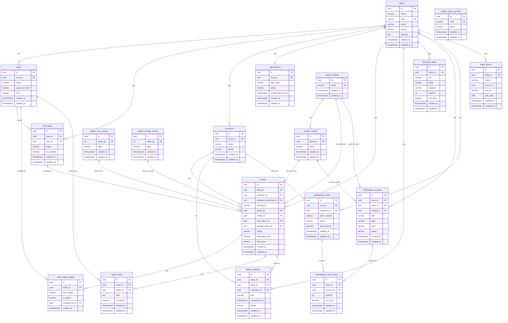
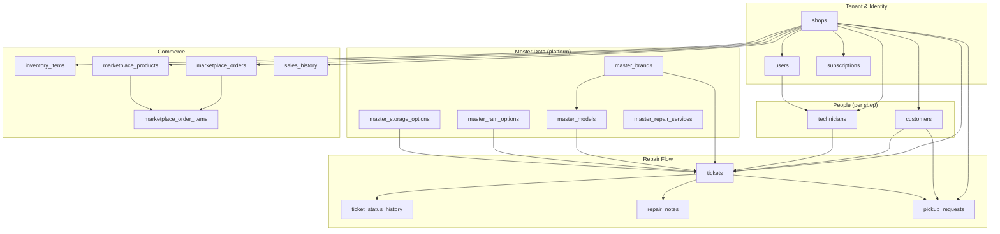

# Entity-Relationship Diagram — Mobile Repair Shop SaaS

All entities use **UUID** primary keys and **multi-tenant** `shop_id` where applicable. Master data tables are platform-wide (no `shop_id`).

---

## 1. Full ER Diagram (Mermaid)

---

## 2. Simplified Diagram by Domain

---

Render in GitHub, VS Code (Mermaid extension), or [mermaid.live](https://mermaid.live).
