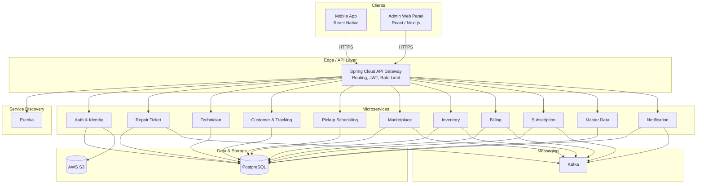
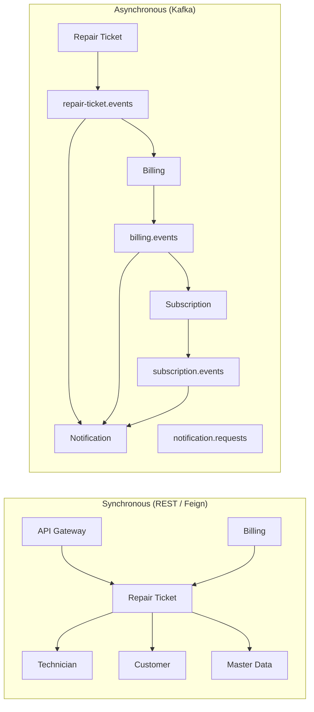
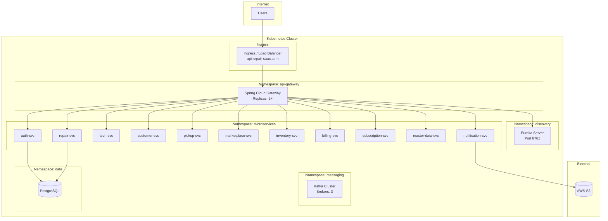
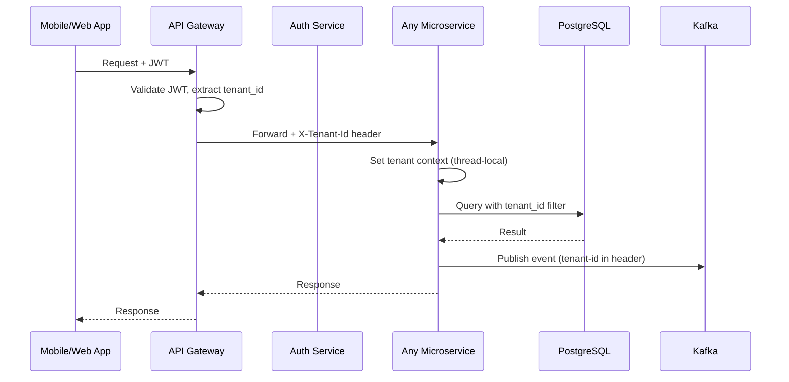
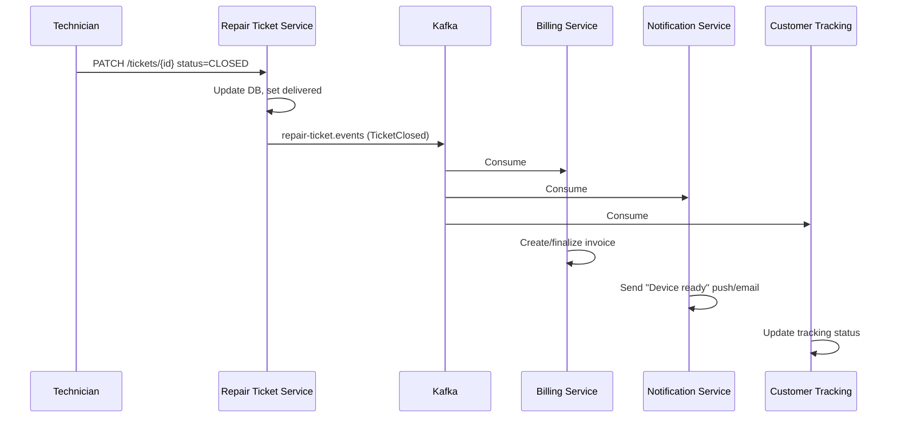
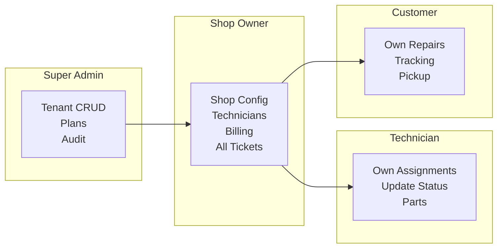

# Architecture Diagrams (Mermaid)

Render these in GitHub, VS Code (Mermaid extension), or [mermaid.live](https://mermaid.live).

---

## 1. System Architecture Diagram

---

## 2. Microservice Communication (Sync vs Async)

---

## 3. Deployment Architecture (Kubernetes)

---

## 4. Multi-Tenant Request Flow

---

## 5. Event-Driven Flow Example (Repair Ticket Closed)

---

## 6. User Roles and Scope

